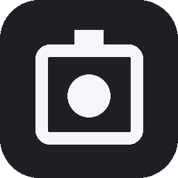
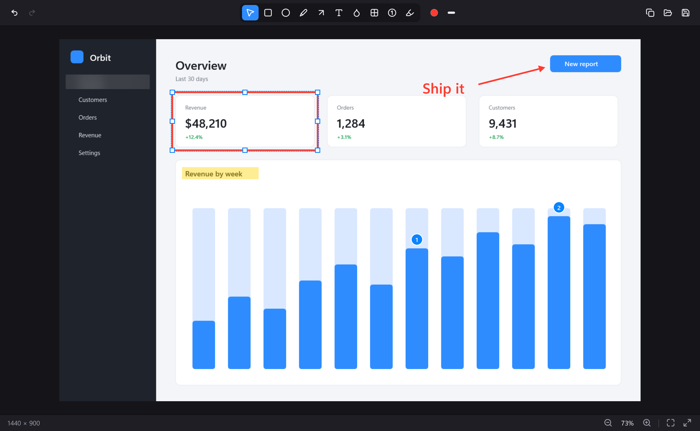

<div align="center">



# NeatShot

**A CleanShot X style screenshot tool for Windows.**

Capture a region, a window or the whole screen, annotate it in a non-destructive editor and get it where it needs to go.

[](https://github.com/ArifKobel/NeatShot/actions/workflows/ci.yml)
[](https://github.com/ArifKobel/NeatShot/releases/latest)
[](LICENSE)

<br />



</div>

<br />

## Install

Download `NeatShot-x.y.z-Setup.exe` from the [latest release](https://github.com/ArifKobel/NeatShot/releases/latest) and run it. No admin rights needed, no .NET runtime to install. A portable zip is available on the same page.

NeatShot lives in the system tray. Press `Alt+Shift+3`, drag a region, done.

## How it works

<table>
<tr>
<td width="50%" valign="top">

**Capture**

`Alt+Shift+1` fullscreen, `Alt+Shift+2` window, `Alt+Shift+3` region. The overlay freezes the desktop first, so the overlay itself never ends up in the shot. Hover snaps to windows, dragging selects a region, and every monitor gets its own DPI-correct overlay.

</td>
<td width="50%" valign="top">

**Quick access**

After every capture a card slides in at the bottom left. Hover it to copy, save, reveal in Explorer or open the editor. Drag the thumbnail into any app to drop the file there, drag it to the left edge to dismiss it. Nothing is written to your pictures folder until you say so.

</td>
</tr>
<tr>
<td valign="top">

**Annotate**

Arrow, rectangle, ellipse, pen, text, counters, highlighter, blur and pixelate. Every annotation stays editable: move it, resize it, change its color or line width, double click text to rewrite it. Drag something past the edge and the canvas grows with it. Undo is unlimited.

</td>
<td valign="top">


</td>
</tr>
</table>

## Shortcuts

| Global | |
| --- | --- |
| `Alt+Shift+1` | Capture fullscreen |
| `Alt+Shift+2` | Capture window |
| `Alt+Shift+3` | Capture region |
| `Alt+Shift+4` | Open the last capture in the editor |

All four can be changed in the settings by pressing the keys you want.

| Editor | |
| --- | --- |
| `V` `R` `O` `P` `A` `T` `N` `H` `B` | Select, rectangle, ellipse, pen, arrow, text, counter, highlight, blur |
| `Ctrl+Z` `Ctrl+Y` | Undo, redo |
| `Ctrl+C` `Ctrl+X` `Ctrl+V` `Ctrl+D` | Copy, cut, paste, duplicate the selection |
| `Delete` | Delete the selection |
| `Arrows` `Shift+Arrows` | Nudge by 1 px, by 10 px |
| `Ctrl+]` `Ctrl+[` | Bring to front, send to back |
| `Ctrl++` `Ctrl+-` `Ctrl+0` `Ctrl+1` | Zoom in, zoom out, fit, actual size |
| `Alt+Drag` `Middle drag` `Space+Drag` | Pan |
| `Ctrl+S` `Ctrl+Shift+S` | Save, save as |
| `Esc` | Clear the selection, then copy the image and close |
| `Ctrl+W` | Close without saving |

## Building

Requires the .NET 10 SDK on Windows 10 1809 or later.

```
dotnet build
dotnet test
dotnet run --project src/NeatShot.App
```

`NeatShot.exe --edit path\to\image.png` opens the editor directly with a file, which is handy while working on it.

Releases are built by GitHub Actions from a `v*` tag: a self-contained single-file publish, an Inno Setup installer and a portable zip.

## Architecture

```
src/
  NeatShot.Core       Domain: capture geometry, annotations, undo history, settings. No UI, no Win32.
  NeatShot.Platform   Win32 via CsWin32: monitor enumeration, GDI capture, window listing,
                      global hotkeys, tray icon, autostart registration, window placement.
  NeatShot.App        WPF shell: tray menu, capture overlay, quick access, editor, settings.
tests/
  NeatShot.Core.Tests xUnit tests for the domain layer.
```

A few decisions worth knowing about:

- **Capture happens before the overlay appears.** The desktop is frozen into a bitmap, the overlay shows that bitmap on every monitor, and the selection is cropped from it.
- **Annotations are immutable records.** Moving or restyling one produces a new record; the document swaps it in through a command that knows how to undo itself. Rendering is a pure function of the document, so the editor and the export share the same code.
- **The canvas is derived, not stored.** It is the image plus whatever annotations reach past its edges, so it grows while you drag and shrinks back on undo.
- **Pixel and DIP coordinates never mix.** `PixelRect` and `PixelPoint` are physical screen pixels, `ImagePoint` and `ImageRect` are annotation space, DIPs exist only inside WPF layout.
- **Core has no Windows dependency.** Everything that touches Win32 sits behind an interface, so the domain stays testable on any runner.

Icons are [Keyline Icons](https://keylineicons.com) with a few from [Lucide](https://lucide.dev), embedded as geometry. See [THIRD-PARTY-NOTICES.md](THIRD-PARTY-NOTICES.md).

## Roadmap

- Scrolling capture
- Screen recording to MP4 and GIF
- Cloud upload with share links

## License

[MIT](LICENSE)
